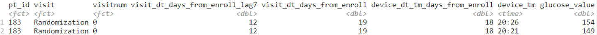

```{r setup, include = FALSE, message = FALSE}
knitr::opts_chunk$set(echo = TRUE)

# Loads libraries
library(tidyverse)
```

# Datasets

We were given three datasets: 

- ds_cgm: glucose values for each patient over time
- ds_subject: demographic and treatment information for the patients
- ds_visit: visit information for each patient
  
```{r}
# Loads in datasets
ds_cgm <- readRDS("../data/ds_cgm.RDS")
ds_subject <- readRDS("../data/ds_subject.RDS")
ds_visit <- readRDS("../data/ds_visit.RDS")
```

## ds_cgm

#### Variables 

- **pt_id**: patient id
- **visit**: visit spelled out
- **visitnum**: visit number
- **visit_dt_days_from_enroll_lag7**: for a given visit, this indicates the number of days that have elapsed since a subject enrolled in the study MINUS - 7 (as we only wanted to keep the data from 7 days prior to a visit) 
- **visit_dt_days_from_enroll**: for a given visit, this indicates the number of days that have elapsed since a subject enrolled in the study
- **device_dt_tm_days_from_enroll**: this variable contains the actual day since enrollment that the CGM was measured. For example, in the two records shown in the snapshot below, you can see that for subject with ID 183 the visit occurred at day 19 after enrollment, 7 days prior to that would be day 12 (the *_lag7 variable) and the actual day since enrollment that CGM was measured is day 18 (so 1 day prior to the visit)
- **device_tm**: contains the actual time that the measurement was taken
- **glucose_value**: glucose value measured by device

```{r fig.width = 10, echo = FALSE}
# Loads the snapshot of data

```

#### Glimpse of Data

```{r}
# Glimpses the ds_cgm dataset
glimpse(ds_cgm)
```

## ds_subject

#### Variables 

- **pt_id**: patient id
- **site_id**: site id
- **gender**: gender of patient
- **ethnicity**: ethnicity of patient
- **diag_age**: age diagnosed with diabetes
- **oth_gluc_lower_med**: indicator variable for whether the patient takes medication to lower glucose levels
- **edu_level**: education level of patient
- **weight**: weight of patient at enrollment
- **height**: height of patient at enrollment
- **cgm_use_status**: information about whether the patient has used CGM before
- **pt_status**: whether or not the patient completed the study
- **trt_group**: treatment group (cgm or both)
- **age_as_of_enroll_dt**: age at enrollment date

#### Glimpse of Data

```{r}
# Glimpses the ds_cgm dataset
glimpse(ds_subject)
```

## ds_visit

#### Variables 

- **pt_id**: patient id
- **visit**: visit spelled out
- **visitnum**: visit number
- **visit_dt_days_from_enroll**: for a given visit, this indicates the number of days that have elapsed since a subject enrolled in the study
- **visit_dt_days_from_enroll_lag7**: for a given visit, this indicates the number of days that have elapsed since a subject enrolled in the study MINUS - 7 (as we only wanted to keep the data from 7 days prior to a visit)

#### Glimpse of Data

```{r}
# Glimpses the ds_cgm dataset
glimpse(ds_visit)
```

# Joining Glucose and Treatment

The dataset ds_cgm has the glucose measurements for the patient over time, but it does not include the treatment. This variable is included in the dataset ds_subject. This variable is added to the dataset below, and a few rows of the new data is shown below.

```{r}
# Adds the treatment to ds_cgm_full
ds_cgm_full <- ds_subject %>%
  select(pt_id, trt_group, pt_status) %>%
  full_join(ds_cgm, by = "pt_id") %>%
  arrange(pt_id)

# Print the first few rows
head(ds_cgm_full)
```

# Removing Missing Data

The plot below shows the observations available for each patient by visit number. The locations with white show were the missing observations are. The red indiciates patients that did not complete the study. We will remove all patients who dropped or have missing values. Note that some patients have missing values but completed the study.

```{r}
ds_cgm_full %>%
  mutate(pt_status = factor(pt_status, levels = c("Dropped", "Completed"))) %>%
  select(visitnum, pt_id, pt_status) %>%
  distinct() %>%
  ggplot(aes(x = visitnum, y = pt_id, fill = pt_status)) + 
  geom_tile()
```

```{r}
complete_participants <- ds_cgm_full %>%
  select(pt_id, visitnum) %>%
  distinct() %>%
  count(pt_id) %>%
  filter(n == 6) %>%
  rename(number_visits = n)
```

```{r}
ds_cgm_complete <- ds_cgm_full %>%
  right_join(complete_participants, by = "pt_id") 
```

The plot below is created using the dataset with the patients who had missing values removed. It is also colored and separated by treatment group. We can see that there are no missing observations now.

```{r}
ds_cgm_complete %>%
  select(visitnum, pt_id, trt_group) %>%
  distinct() %>%
  ggplot(aes(x = visitnum, y = pt_id, fill = trt_group)) + 
  geom_tile() + 
  facet_grid(trt_group ~ ., scales = "free_y") + 
  theme(legend.position = "remove")
```

The below shows the number of patients in the original dataset and the number of patients in the dataset with the missing observations removed. This shows that we removed 13 participants that had missing observations, and there are 213 participants with complete observations.

```{r}
data.frame(dataset = c("Original", "Missing Removed"),
           numpatients = c(length(unique(ds_cgm_full$pt_id)),
                           length(unique(ds_cgm_complete$pt_id))))
```

```{r}
write.csv(ds_cgm_complete, "../data/ds_cgm_complete.csv", row.names = FALSE)
```

# Subsetting the Data for Initial Work

For the initial fitting of models, we decided to create subsets of the data. We decided to create 10 subsets of the data with 10 participants in each. Half of the participants come from the CGM only group and the other half are from the CGM+BGM group. To do this, we randomly sampled 5 patients from each treatment group without replacement for each of the 10 subsets. Thus, each of the subsets will contain distinct participants.

```{r warning = FALSE}
# Randomly order the cgm patients
set.seed(20190717)
cgm_pt_random <- ds_cgm_complete %>% 
  filter(trt_group == "CGM Only") %>%
  pull(pt_id) %>%
  unique() %>%
  sample(replace = FALSE)

# Randomly order the cgm+bgm patients
set.seed(20190717)
both_pt_random <- ds_cgm_complete %>% 
  filter(trt_group == "CGM+BGM") %>%
  pull(pt_id) %>%
  unique() %>%
  sample(replace = FALSE)

# Creates a dataset of the random order of patients and assigns them to groups
pt_plus_group <- data.frame(pt_id = factor(c(as.character(cgm_pt_random[1:50]),
                                             as.character(both_pt_random[1:50]))), 
           subgroup = factor(rep(rep(1:10, each = 5), 2)))

# Joins the group variable with the complete dataset
ds_cgm_complete_grouped <- ds_cgm_complete %>%
  filter(visitnum == 5) %>%
  right_join(pt_plus_group, by = "pt_id") %>%
  mutate(pt_id = factor(pt_id))

# Creates the 10 subsets
ds_cgm_sub1 <- ds_cgm_complete_grouped %>% 
  filter(subgroup == 1) %>% 
  select(-number_visits, -subgroup)
ds_cgm_sub2 <- ds_cgm_complete_grouped %>% 
  filter(subgroup == 2) %>% 
  select(-number_visits, -subgroup)
ds_cgm_sub3 <- ds_cgm_complete_grouped %>% 
  filter(subgroup == 3) %>% 
  select(-number_visits, -subgroup)
ds_cgm_sub4 <- ds_cgm_complete_grouped %>% 
  filter(subgroup == 4) %>% 
  select(-number_visits, -subgroup)
ds_cgm_sub5 <- ds_cgm_complete_grouped %>% 
  filter(subgroup == 5) %>% 
  select(-number_visits, -subgroup)
ds_cgm_sub6 <- ds_cgm_complete_grouped %>% 
  filter(subgroup == 6) %>% 
  select(-number_visits, -subgroup)
ds_cgm_sub7 <- ds_cgm_complete_grouped %>% 
  filter(subgroup == 7) %>% 
  select(-number_visits, -subgroup)
ds_cgm_sub8 <- ds_cgm_complete_grouped %>% 
  filter(subgroup == 8) %>% 
  select(-number_visits, -subgroup)
ds_cgm_sub9 <- ds_cgm_complete_grouped %>% 
  filter(subgroup == 9) %>% 
  select(-number_visits, -subgroup)
ds_cgm_sub10 <- ds_cgm_complete_grouped %>% 
  filter(subgroup == 10) %>% 
  select(-number_visits, -subgroup)
```

```{r}
# Exports the subset datasets
write.csv(x = ds_cgm_sub1, file = "../data/ds_cgm_sub1.csv", row.names = FALSE)
write.csv(x = ds_cgm_sub2, file = "../data/ds_cgm_sub2.csv", row.names = FALSE)
write.csv(x = ds_cgm_sub3, file = "../data/ds_cgm_sub3.csv", row.names = FALSE)
write.csv(x = ds_cgm_sub4, file = "../data/ds_cgm_sub4.csv", row.names = FALSE)
write.csv(x = ds_cgm_sub5, file = "../data/ds_cgm_sub5.csv", row.names = FALSE)
write.csv(x = ds_cgm_sub6, file = "../data/ds_cgm_sub6.csv", row.names = FALSE)
write.csv(x = ds_cgm_sub7, file = "../data/ds_cgm_sub7.csv", row.names = FALSE)
write.csv(x = ds_cgm_sub8, file = "../data/ds_cgm_sub8.csv", row.names = FALSE)
write.csv(x = ds_cgm_sub9, file = "../data/ds_cgm_sub9.csv", row.names = FALSE)
write.csv(x = ds_cgm_sub10, file = "../data/ds_cgm_sub10.csv", row.names = FALSE)
```

# new section